#######################
KAFKA WITH DATABRICKS
#######################

INTRODUCTION
-------------

This tutorial assumes you are starting fresh and have no existing Kafka or ZooKeeper data.

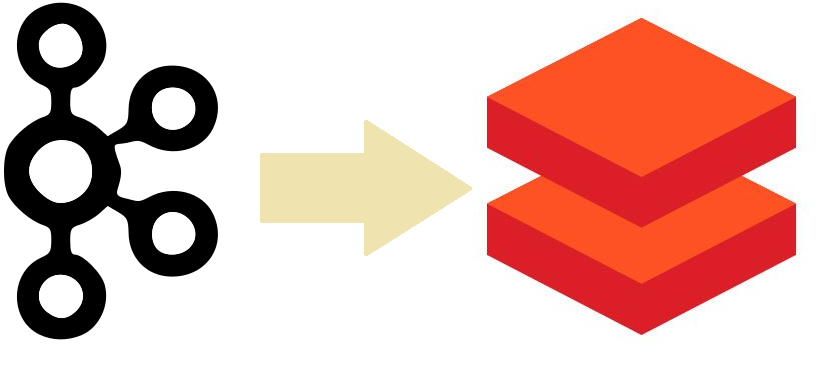
   
KAFKA SETUP WITH DATABRICKS
-----------------------------

STEP 1 : Login to Databricks
===============================

:ref: https://community.cloud.databricks.com/login.html;jsessionid=webapp-shard-ce2-webapp-5c5bbd9f87-ngfbqvocwt5f40zv8o2e01k0plh7l.webapp-shard-ce2-webapp-5c5bbd9f87-ngfbq

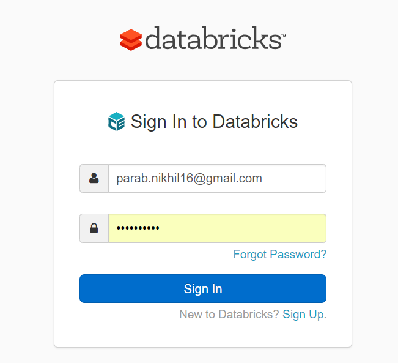
   
STEP 2 : In workspace, go to user and create files
===================================================

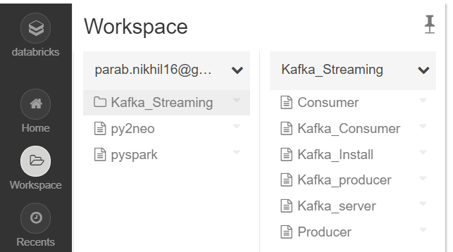
   
STEP 3 : Install Kafka 
=======================

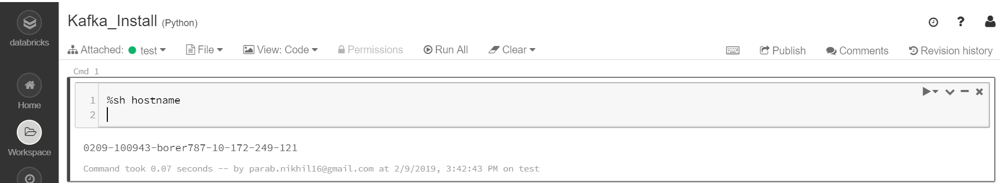

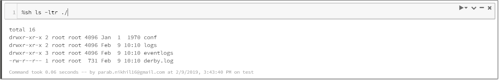
   
- Download kafka using wget command

.. code-block:: bash
  
   $ wget http://mirrors.estointernet.in/apache/kafka/0.10.2.2/kafka_2.10-0.10.2.2.tgz
   
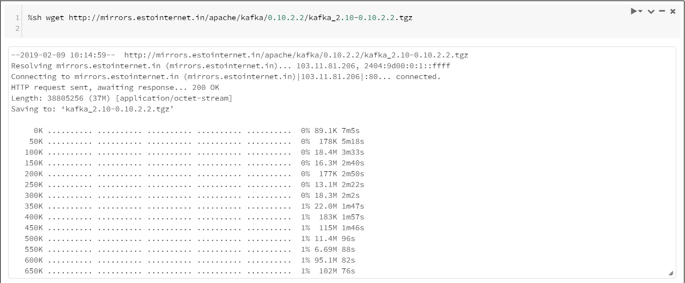
   
- Extract downloded file

.. code-block:: bash

   $ tar -xzf kafka_2.11-2.1.0.tgz
   
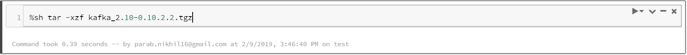
   
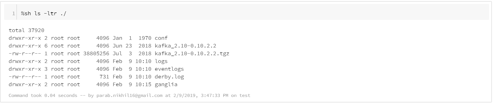
   
STEP 3 : Start the server
==========================

.. code-block:: bash

   $ cd kafka_2.10-0.10.2.2
   $ ls -ltr ./
   $ bin/zookeeper-server-start.sh config/zookeeper.properties

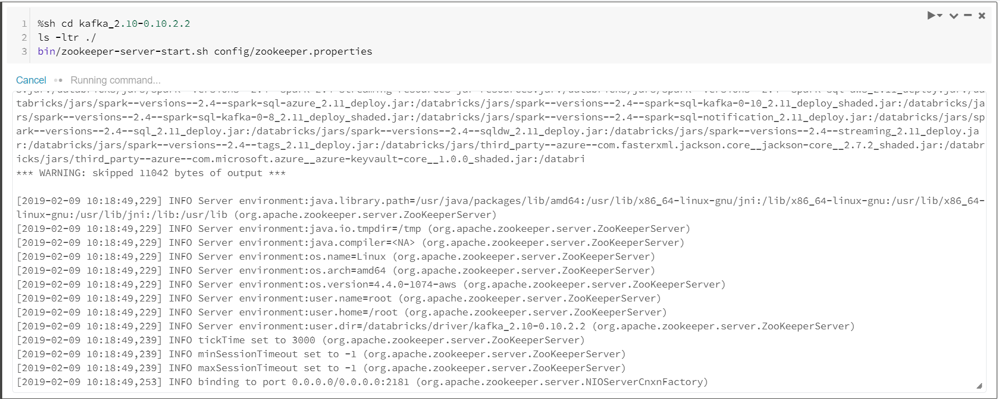
   
.. code-block:: bash

   $ ls -ltr
   $ cd kafka_2.10-0.10.2.2
   $ bin/kafka-server-start.sh config/server.properties
   
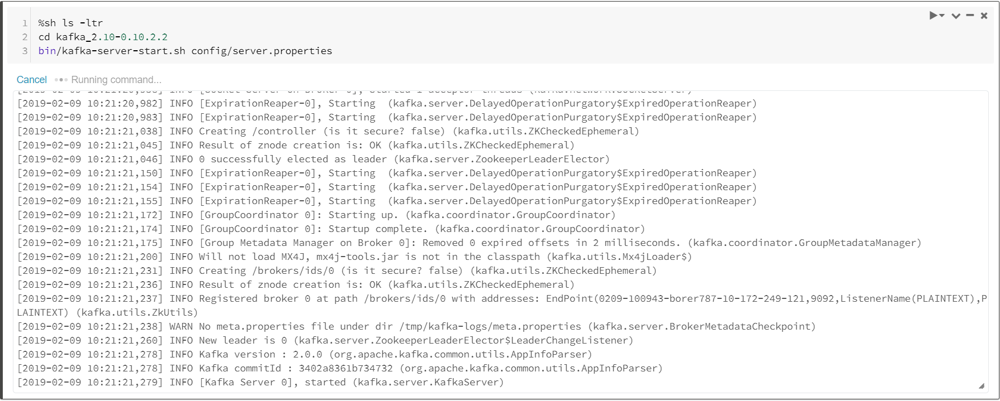
   
STEP 4 : Create Topic
======================

.. code-block:: bash

   $ ls -ltr
   $ cd kafka_2.10-0.10.2.2
   $ bin/kafka-topics.sh --create --zookeeper localhost:2181 --replication-factor 1 --partitions 1 --topic test
   
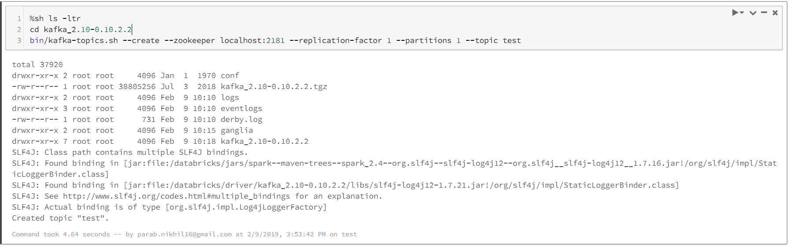

- List the topics

.. code-block:: bash

   $ ls -ltr
   $ cd kafka_2.10-0.10.2.2
   $ bin/kafka-topics.sh --list --zookeeper localhost:2181
   
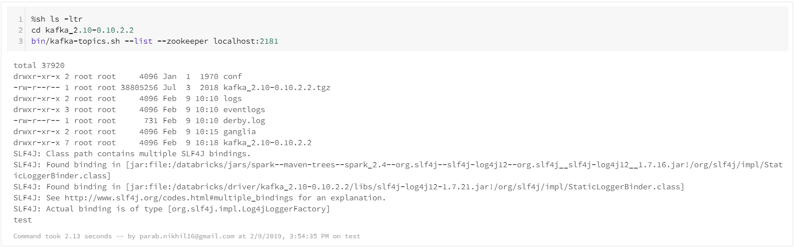
   
STEP 5 : Start producer and send some messages to consumer
============================================================

.. code-block:: bash

   $ ls -ltr
   $ cd kafka_2.10-0.10.2.2
   $ echo "This is another message1" | bin/kafka-console-producer.sh --broker-list localhost:9092 --topic test
   
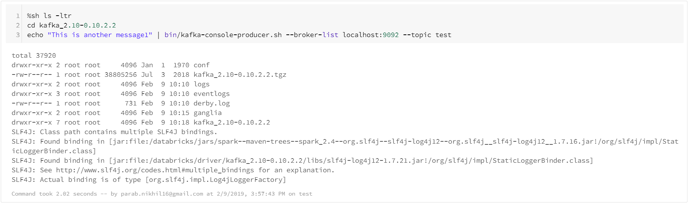
   
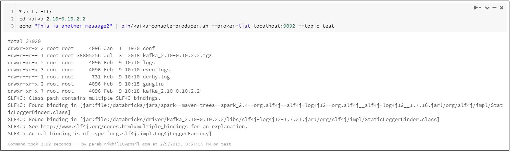
   
STEP 6 : Start the consumer
============================

.. code-block:: bash

   $ ls -ltr
   $ cd kafka_2.10-0.10.2.2
   $ bin/kafka-console-consumer.sh --bootstrap-server localhost:9092 --topic test --from-beginning
   
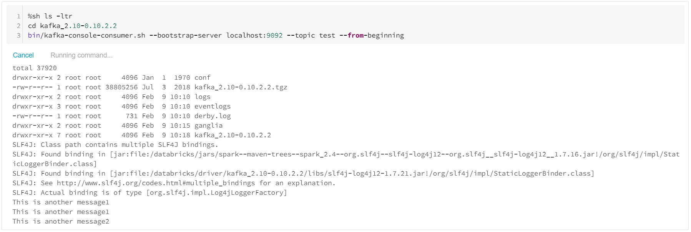

