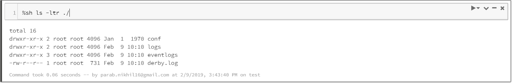
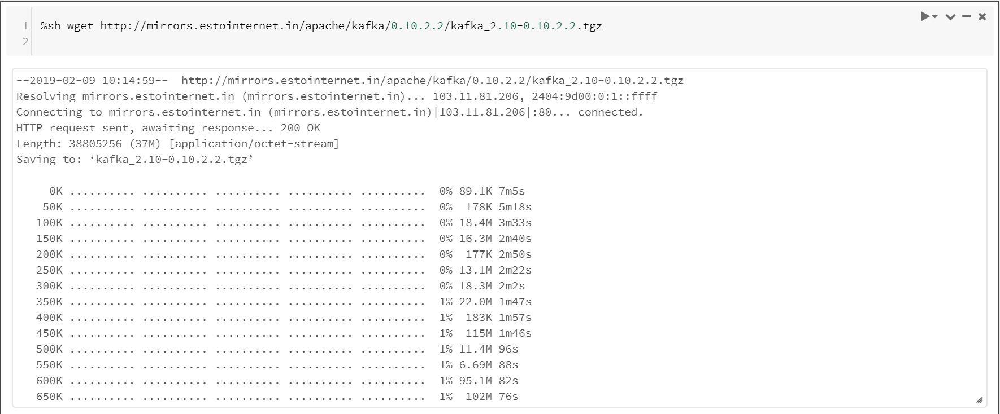
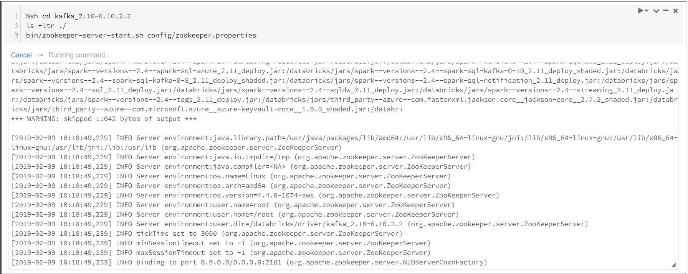
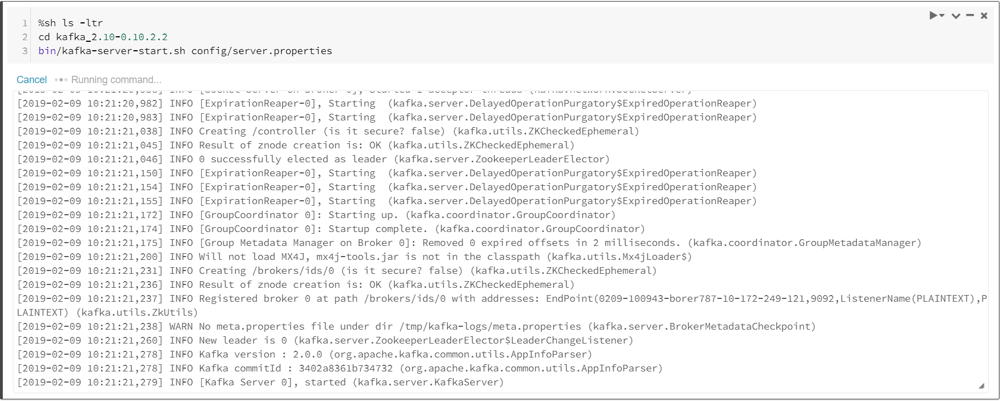

##########
Use Case
##########

Consume Messages From Tweeter
------------------------------

STEP 1 : Create cluster in Databricks
======================================

Click on cluster on console and create new cluster

   
.. image:: kafka17.PNG
   :width: 800px
   :height: 400px
   :alt: alternate text
   
STEP 2 : Attach and install libraries to cluster
=================================================

   
STEP 3 : Install and Start kafka
==================================

.. image:: kafka1.PNG
   :width: 800px
   :height: 200px
   :alt: alternate text

   
- Download kafka using wget command

.. code-block:: bash
  
   $ wget http://mirrors.estointernet.in/apache/kafka/0.10.2.2/kafka_2.10-0.10.2.2.tgz
   

   
- Extract downloded file

.. code-block:: bash

   $ tar -xzf kafka_2.11-2.1.0.tgz
   
.. image:: kafka4.PNG
   :width: 800px
   :height: 100px
   :alt: alternate text 
   
.. image:: kafka5.PNG
   :width: 800px
   :height: 200px
   :alt: alternate text 
   
.. code-block:: bash

   $ cd kafka_2.10-0.10.2.2
   $ ls -ltr ./
   $ bin/zookeeper-server-start.sh config/zookeeper.properties

   
.. code-block:: bash

   $ ls -ltr
   $ cd kafka_2.10-0.10.2.2
   $ bin/kafka-server-start.sh config/server.properties
   

STEP 4 : Start the producer

.. code-block:: python

   import java.util.Properties
   import org.apache.kafka.clients.producer.Producer
   import org.apache.kafka.clients.producer.KafkaProducer
   import org.apache.kafka.clients.producer.ProducerRecord

   // Configuration for Kafka brokers
   val kafkaBrokers = "localhost:9092"
   val topicName = "test"

   val props = new Properties()
   props.put("bootstrap.servers", kafkaBrokers)
   props.put("acks", "all")
   props.put("key.serializer", "org.apache.kafka.common.serialization.StringSerializer")
   props.put("value.serializer", "org.apache.kafka.common.serialization.StringSerializer")
      
   val producer = new KafkaProducer[String, String](props)

   def sendEvent(message: String) = {
     val key = java.util.UUID.randomUUID().toString()
     producer.send(new ProducerRecord[String, String](topicName, key, message)) 
     System.out.println("Sent event with key: '" + key + "' and message: '" + message + "'\n")
   }

.. code-block:: python

   val twitterConsumerKey="uC2DSEXGeu0sBgd4ixpnaUGbI"
   val twitterConsumerSecret="0YtiLEUVo2rrbd8pEE5UNTyaQtAxdTDgmDnH0aaKkgP8oLSHLJ"
   val twitterOauthAccessToken="779301155956338692-OzAYBWMegDBq5pYRHaINgh7qQUoVBn7"
   val twitterOauthTokenSecret="XchWmSBKEWpK2X2bk3JbTAg2ZKUA6TdoJXELEVWfyBCNr"
   

   
.. code-block:: python

   import java.util._
   import scala.collection.JavaConverters._
   import twitter4j._
   import twitter4j.TwitterFactory
   import twitter4j.Twitter
   import twitter4j.conf.ConfigurationBuilder

   val cb = new ConfigurationBuilder()
     cb.setDebugEnabled(true)
       .setOAuthConsumerKey(twitterConsumerKey)
       .setOAuthConsumerSecret(twitterConsumerSecret)
       .setOAuthAccessToken(twitterOauthAccessToken)
       .setOAuthAccessTokenSecret(twitterOauthTokenSecret)

   val twitterFactory = new TwitterFactory(cb.build())
   val twitter = twitterFactory.getInstance()

   val query = new Query(" #Azure ")
   query.setCount(100)
   query.lang("en")
   var finished = false
   while (!finished) {
     val result = twitter.search(query) 
     val statuses = result.getTweets()
     var lowestStatusId = Long.MaxValue
     for (status <- statuses.asScala) {
       if(!status.isRetweet()){ 
         sendEvent(status.getText())
         Thread.sleep(4000)
       }
       lowestStatusId = Math.min(status.getId(), lowestStatusId)
     }
     query.setMaxId(lowestStatusId - 1)
   }
   

   
STEP 5 : Start the consumer

.. code-block:: python

   // Configuration for Kafka brokers
   val kafkaBrokers = "localhost:9092"
   

   
.. code-block:: python

   val rowBikeData = spark.readStream.format("kafka").option("kafka.bootstrap.servers", kafkaBrokers).option("subscribe", "test").load()
   

   
.. code-block:: python

   val BikeData = rowBikeData.selectExpr("CAST(key AS STRING)","CAST(value AS STRING)","CAST(topic AS STRING)","CAST(offset AS STRING)","CAST(timestamp AS STRING)")
 

   
.. code-block:: python

   BikeData.writeStream.outputMode("append").format("console").option("truncate", false).start().awaitTermination() 

   
   
